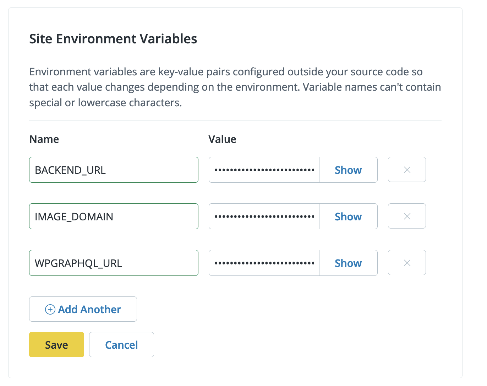
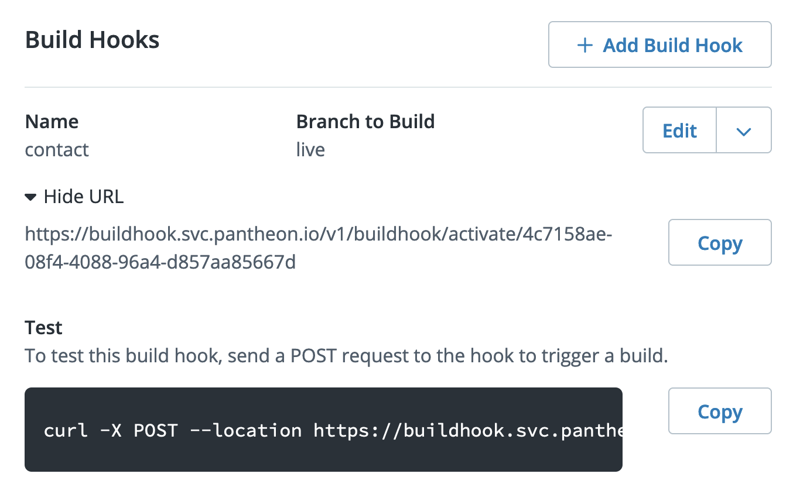
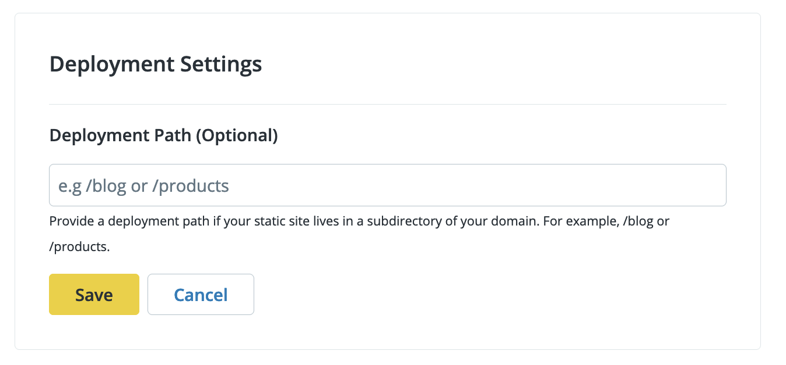

This section provides information on Settings. You can configure Front-End Site settings in the Pantheon dashboard, including:

- General Settings: Site Details and the Connected Git repository
- Build and Output settings
- Site Environment Variables
- Build Hooks
- Deployment settings

## General Settings

You can change the Site Name and connect or disconnect your Git repository in General Settings.

### Change Site Name

1. Navigate to your site dashboard and select the site you want to change the name of.

1. Click **Settings** or **General**.

1. Click the **Edit** button in the **Site Details** section.

1. Enter the new name and click **Save**.

### Connect or Disconnect a Git Repository

Note that a repository cannot be connected to more than one Front-End Site.
There are known issues around disconnecting and reconnecting a repository.

1. Navigate to your site dashboard and select the site you want to connect or disconnect with your Git repository.

1. Click **Settings** or **General**.

1. Click the **Connect** or **Disconnect** button in the **Connected Git Repository** section. Confirm your selection when prompted if you are disconnecting your Git repository.

## CMS Settings

You can link your CMS to your Front-End Site if you’re already managing content through a Pantheon-hosted site. Changes made in Drupal or WordPress will automatically render on the page. Note that linking your CMS is optional.

### Configure CMS Connections

1. Navigate to your site dashboard and select the site you want to configure CMS Connections for.

1. Click **Settings** and then click **CMS**.

1. Click the **Get Started** or **Make Changes** button in the **CMS Connections** section. The Get Started button displays if you have not added a CMS connection yet.

1. Select your **CMS backend** from the drop-down menu.

1. Select the **environment** to source content from.

1. Click **Save**.

## Build and Output Settings

You can configure and edit the following Build and Output Settings:

- Root Directory
    - This allows you to define the project's path if it's located in a subdirectory within your Git repo.
- Build Command
- Output Directory

### Configure Build and Output Settings

1. Navigate to your site dashboard and select the site you want to configure Build and Output settings for.

1. Click **Settings** and then click **Builds**.

1. Click the **Edit** button in the **Build & Output Settings** section.

1. Enter your desired settings and click **Save**.

## Site Environment Variables

Environment variables are key-value pairs configured outside your source code. This means that each value changes depending on the environment.

### Environment Variable Naming Restrictions

<Partial file="decoupled-site-environment-variables.md" />

### Add Site Environment Variables

1. Navigate to your site dashboard and select the site you want to configure Site Environment Variables for.

1. Click **Settings** and then click **Builds**.

1. Click the **Get Started** or **Make Changes** button in the **Site Environment Variables** section. The Get Started button displays if you have not added any Site Environment Variables yet.

1. Enter your desired key-value pairs and click **Save**.

## Build Hooks

Build Hooks allow you to trigger a build automatically when you update the content in your content management system (CMS). You can use Build Hooks for your Front-End site if your CMS is hosted on Pantheon or hosted elsewhere.

Your Pantheon Front-End site will rebuild and include your new content when a Build Hook is triggered. Each Build Hook you generate has a unique URL.

You can create and manage Build Hooks in the Pantheon Dashboard. You must
 [configure your backend](/guides/decoupled/overview/build-hooks#use-build-hooks-with-a-backend-starter-kit) to use the Build Hooks you create in the Pantheon dashboard.

### Add a Build Hook

1. Navigate to your site dashboard and select the site you want to add a Build Hook to.

1. Click **Settings** and then click **Builds**.

1. Scroll down to the **Build Hooks** section and click **Add**.

1. Name your Build Hook and then select the branch from the **Branch to Build** drop-down menu.

1. Click **Generate**. You will see the Build Hook listed under the Build Hooks section in the dashboard.

1. Click **Show URL** and then click **Copy** to copy your unique Build Hooks URL.

1. Optional. Copy the cURL code under **Test** if you want to test triggering a build with your hook.

### Edit a Build Hook

1. Navigate to your site dashboard and select the site with the Build Hook you want to edit.

1. Click **Settings** and then click **Builds**.

1. Scroll down to the **Build Hooks** section, select **Edit** from the **Edit** drop-down menu next to the Build Hook you want to make changes to.

1. Update the Build Hook information and then click **Save Changes**.

### Regenerate a Build Hook

The Build Hook name will remain the same, but your URL will be updated each time you regenerate your Build Hook. Take note of the new URL and update it where needed.

1. Navigate to your site dashboard and select the site you want to regenerate a Build Hook for.

1. Click **Settings** and then click **Builds**.

1. Scroll down to the **Build Hooks** section, select **Regenerate** from the **Edit** drop-down menu next to the Build Hook you want to regenerate.

1. Click **Yes** to confirm your selection and then click **Regenerate Hook**.

1. Click **Show URL** and then click **Copy** to copy your new unique Build Hooks URL.

### Delete a Build Hook

1. Navigate to your site dashboard and select the site with the Build Hook you want to delete.

1. Click **Settings** and then click **Builds**.

1. Scroll down to the **Build Hooks** section, select **Delete** from the **Edit** drop-down menu next to the Build Hook you want to delete.

1. Click **Yes** to confirm your selection and then click **Delete Hook**.

### Use Build Hooks with a Backend Starter Kit

#### Drupal Backend Starter Kit and Build Hooks

Refer to [Configure Build Hooks](/guides/decoupled/drupal-backend-starters/build-hooks) for information on how to configure your Build Hook on your Drupal backend.

#### WordPress Backend Starter Kit and Build Hooks

Refer to [Configure Build Hooks](/guides/decoupled/wp-backend-starters/build-hooks) for information on how to configure your Build Hook on your WordPress backend.

## Deployment Settings

You can provide a deployment path if your static site lives in a subdirectory of your domain. For example, `/blog` or `/products`. Note that this is an optional setting.

### Set Deployment Path

1. Navigate to your site dashboard and select the site you want to configure the Deployment Settings for.

1. Click **Settings** and then click **Builds**.

1. Click the **Get Started** or **Make Changes** button in the **Deployment Settings** section. The Get Started button displays if you have not added any deployment settings yet.

1. Enter your desired **Deployment Path** and click **Save**.

